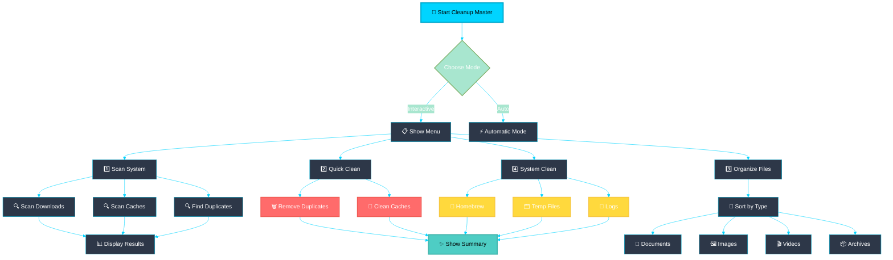
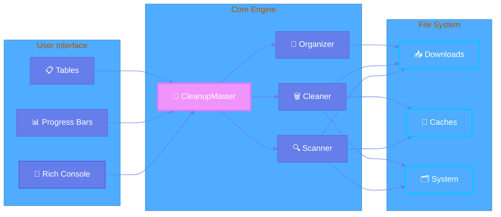
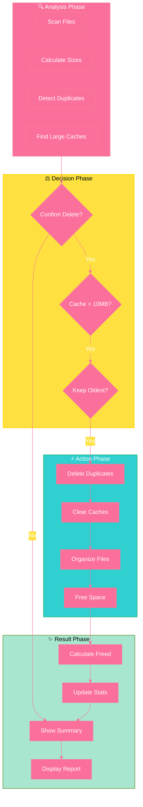
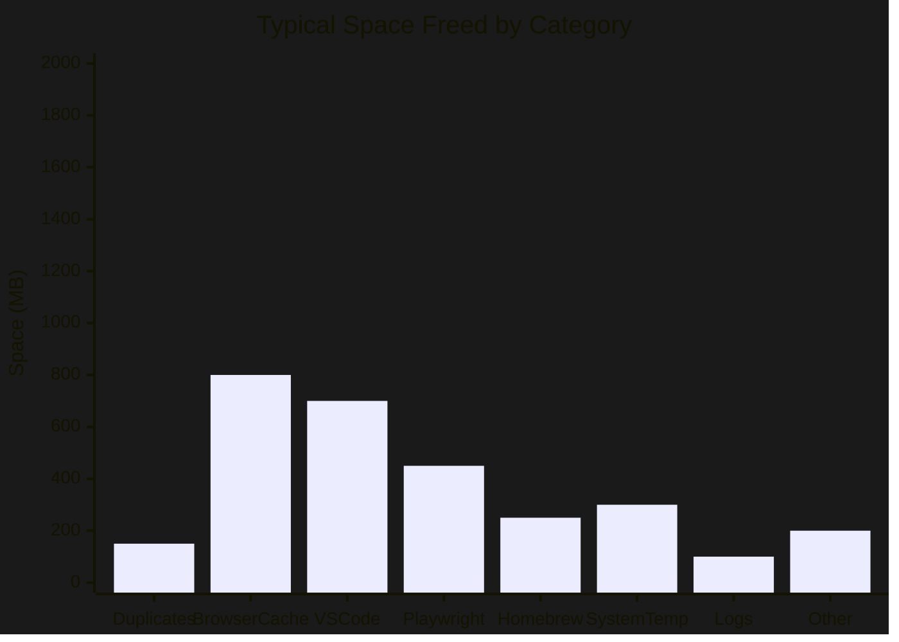
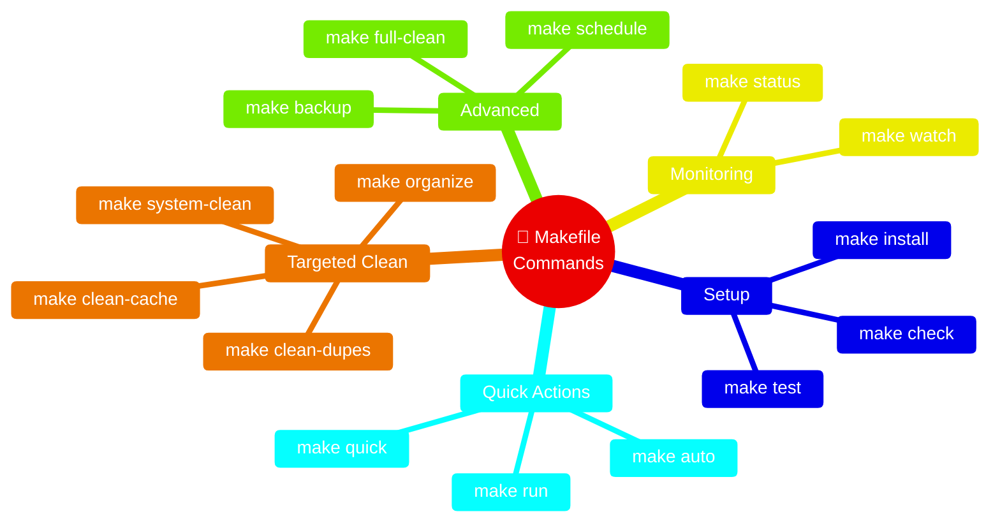
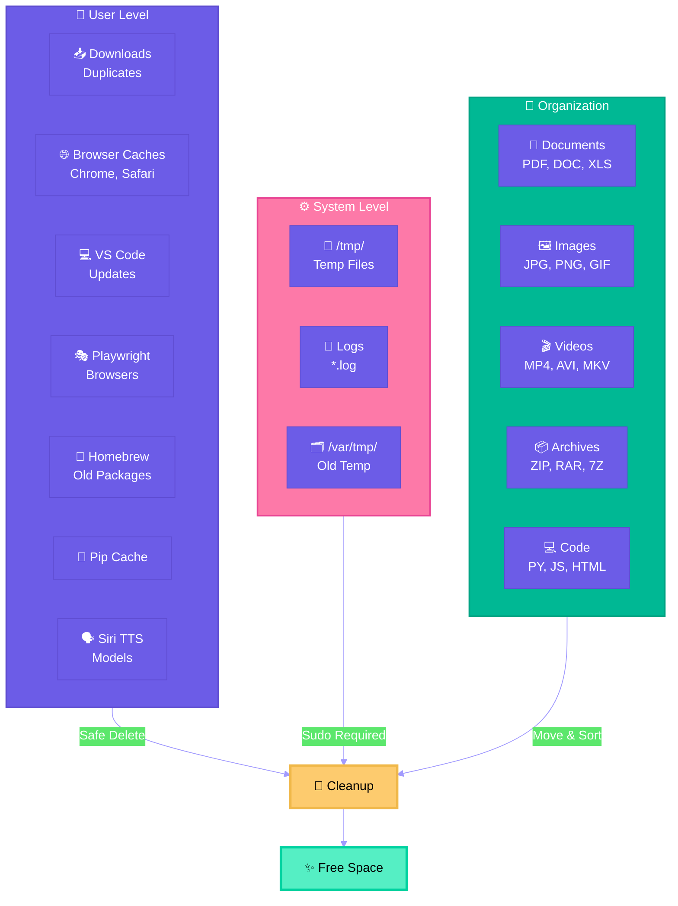
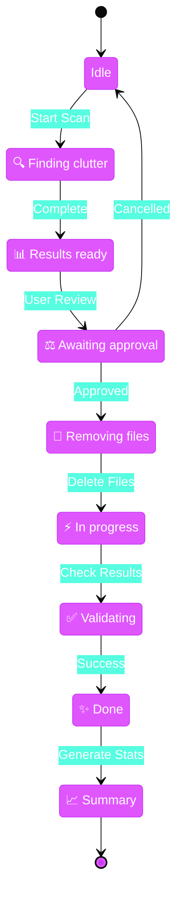
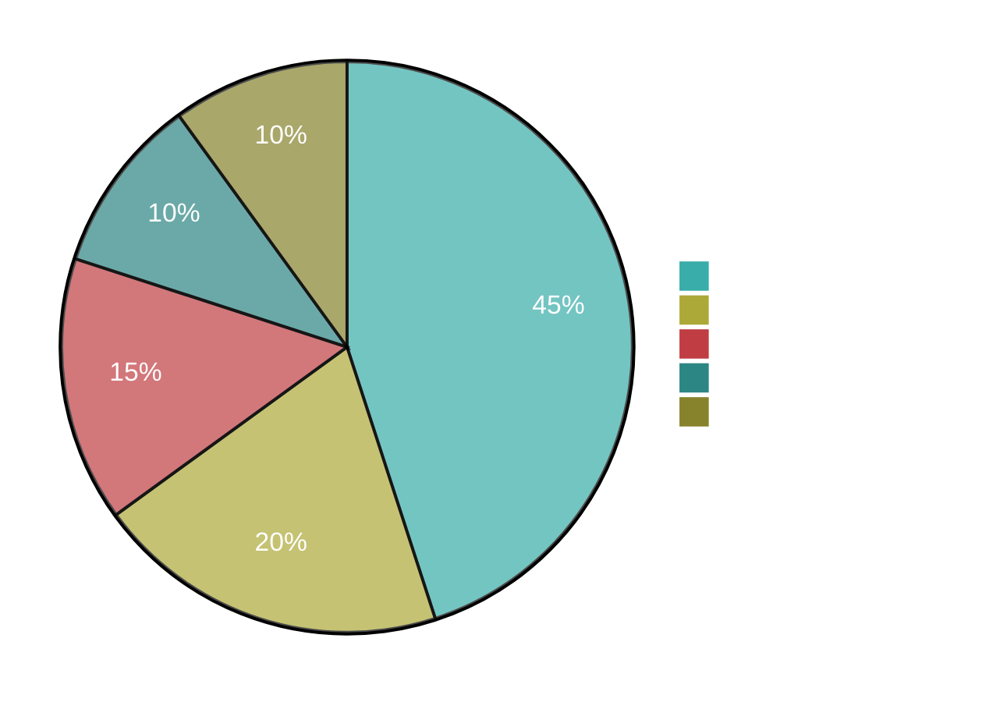
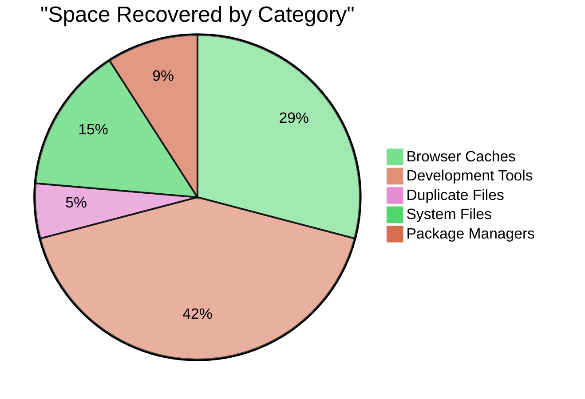

# 🧹 System Cleanup Master

A beautiful, interactive Python script to clean up your macOS system, remove clutter, and free up disk space with a colorful terminal UI.

## 📊 Workflow Overview



## 🏗️ System Architecture



## 💾 Space Recovery Process



## 📈 Performance Impact



## ✨ Features

- 🔍 **Smart Scanning** - Detects duplicates, large files, and bloated caches
- 🎨 **Beautiful UI** - Colorful terminal interface with progress bars
- 📊 **Detailed Reports** - See exactly what's taking up space
- 🗑️ **Safe Cleaning** - Asks for confirmation before deleting
- 📁 **Auto-Organization** - Sorts files by category (Documents, Images, Videos, etc.)
- 💾 **System-Wide Cleanup** - Clears Homebrew, temp files, and logs
- ⚡ **Fast & Efficient** - Parallel scanning with progress indicators

## 🚀 Installation

```bash
# Clone or navigate to the directory
cd /Users/sri/cleanup

# The virtual environment is already set up!
# Dependencies: rich, click, psutil (already installed)
```

## 📖 Usage

### Interactive Mode (Recommended)
```bash
python cleanup_master.py
```

This launches a beautiful menu where you can:
1. 🔍 Scan System for Clutter
2. 🧹 Quick Clean (Remove duplicates & caches)
3. 📁 Organize Downloads
4. 🔧 System-Wide Cleanup
5. 📊 Show Summary

### Using Makefile (Easiest!)



**Popular Commands:**
```bash
make status          # 📊 Check disk usage
make run             # 🎮 Interactive menu
make auto            # ⚡ Auto cleanup
make clean-cache     # 🧹 Clean caches only
make organize        # 📁 Sort Downloads
make full-clean      # 💥 Complete cleanup
```

### Automatic Mode
```bash
python cleanup_master.py --auto
```
Runs a complete cleanup automatically (still asks for confirmation).

### Direct Execution
```bash
./cleanup_master.py
```

## 🎯 What It Cleans



### User-Level
- ✅ Duplicate files in Downloads
- ✅ Browser caches (Chrome, Safari, etc.)
- ✅ VS Code update caches
- ✅ Playwright browser caches
- ✅ Homebrew caches
- ✅ Pip caches
- ✅ SiriTTS model caches
- ✅ App-specific caches

### System-Level (with sudo)
- ✅ System temporary files
- ✅ Homebrew old packages
- ✅ System logs

### File Organization
Automatically categorizes files into:
- 📄 Documents (PDF, DOC, XLS, PPT, TXT)
- 🖼️ Images (JPG, PNG, GIF, SVG)
- 🎬 Videos (MP4, AVI, MKV, MOV)
- 📦 Archives (ZIP, RAR, 7Z, TAR)
- 💻 Code (PY, JS, HTML, CSS, JAVA)

## 🛡️ Safety Features

- **Confirmation Prompts** - Always asks before deleting
- **Duplicate Detection** - Keeps oldest file by default
- **Size Thresholds** - Only cleans caches > 10MB
- **Error Handling** - Continues even if some files can't be deleted
- **Detailed Logging** - Shows exactly what was cleaned

## 📸 Screenshots

```
  ██████╗██╗     ███████╗ █████╗ ███╗   ██╗██╗   ██╗██████╗ 
 ██╔════╝██║     ██╔════╝██╔══██╗████╗  ██║██║   ██║██╔══██╗
 ██║     ██║     █████╗  ███████║██╔██╗ ██║██║   ██║██████╔╝
 ██║     ██║     ██╔══╝  ██╔══██║██║╚██╗██║██║   ██║██╔═══╝ 
 ╚██████╗███████╗███████╗██║  ██║██║ ╚████║╚██████╔╝██║     
  ╚═════╝╚══════╝╚══════╝╚═╝  ╚═╝╚═╝  ╚═══╝ ╚═════╝ ╚═╝     
```

## 🔧 Requirements

- Python 3.7+
- macOS (tested on macOS Monterey+)
- Dependencies:
  - `rich` - Beautiful terminal formatting
  - `click` - CLI framework
  - `psutil` - System utilities

## � State Machine



## �💡 Tips

1. **Run regularly** - Schedule weekly cleanups for best results
2. **Check before deleting** - Review the scan results before cleaning
3. **Backup important files** - Always have backups of critical data
4. **Use automatic mode** - Great for scheduled maintenance
5. **System cleanup** - Run system-wide cleanup monthly

## 🎨 Color Guide

- 🔵 **Cyan** - Information and headers
- 🟢 **Green** - Success messages and sizes
- 🟡 **Yellow** - Warnings and scans
- 🔴 **Red** - Errors and deletions
- 🟣 **Magenta** - Highlights and duplicates

## 📊 Typical Results





Average cleanup frees up:
- **1-5 GB** - Normal usage
- **5-20 GB** - Heavy browser/development use
- **20-50 GB** - Long-term accumulation

## 🤝 Contributing

Feel free to enhance the script:
- Add more file categories
- Support for other operating systems
- Additional cache directories
- Smart duplicate detection algorithms

## 📝 License

Free to use and modify for personal and commercial use.

## ⚠️ Disclaimer

This tool permanently deletes files. While it includes safety measures, always:
- Review what will be deleted
- Keep backups of important data
- Test on non-critical systems first

## 🆘 Support

Common issues:
- **Permission denied**: Run specific cleanups with `sudo` when prompted
- **No files found**: Your system is already clean!
- **Import errors**: Reinstall dependencies with `pip install rich click psutil`

---

Made with ❤️ for keeping your Mac clean and fast!
