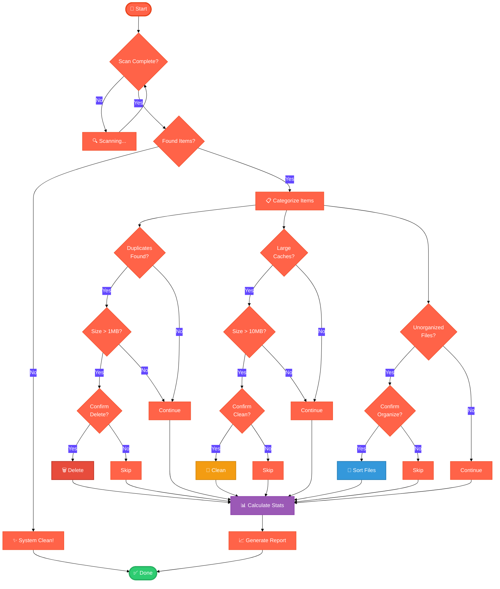
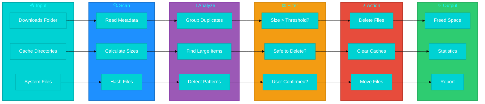
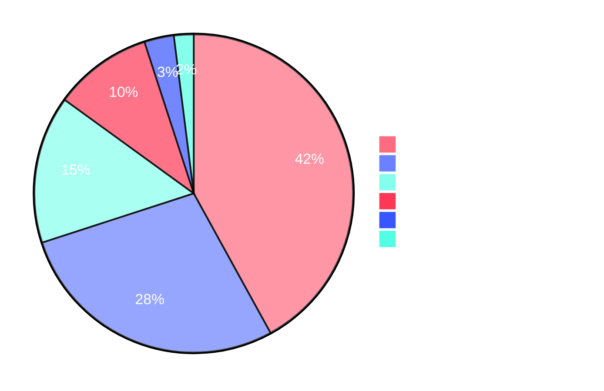
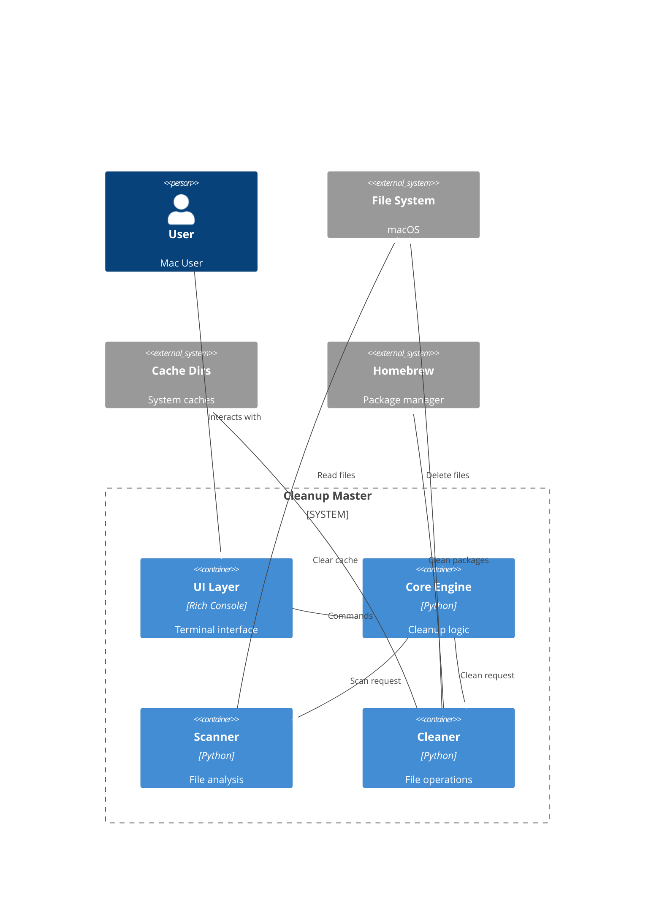
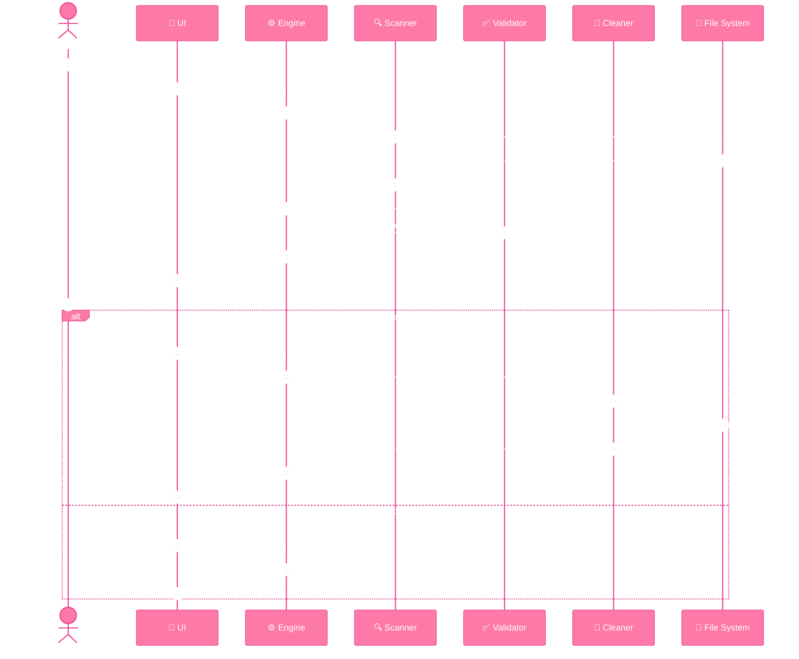
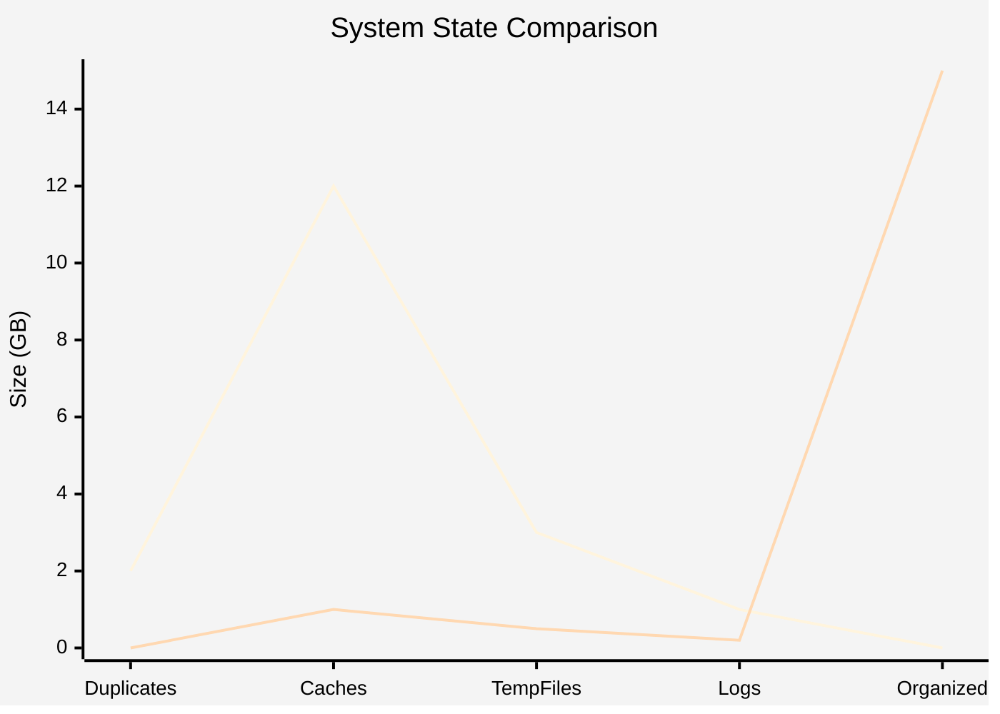
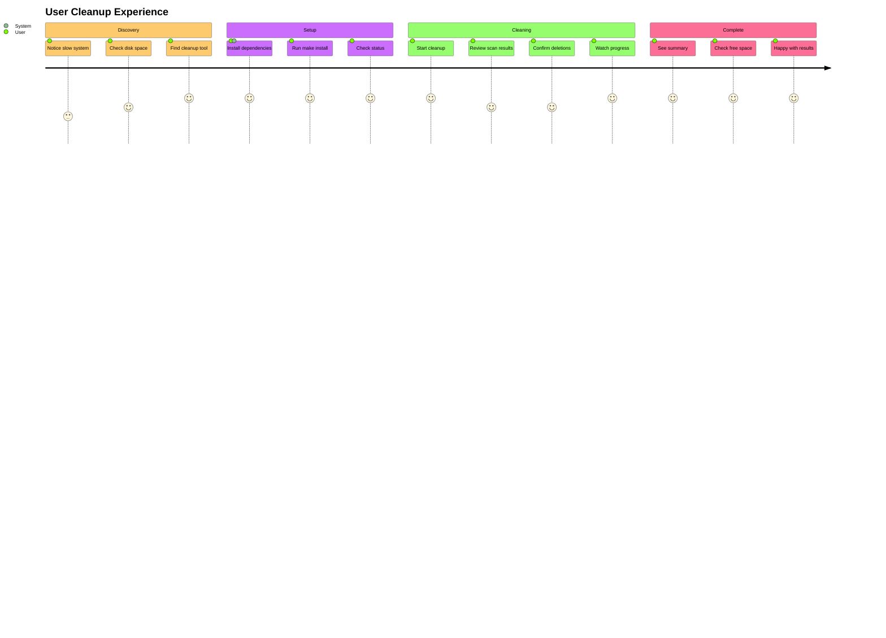
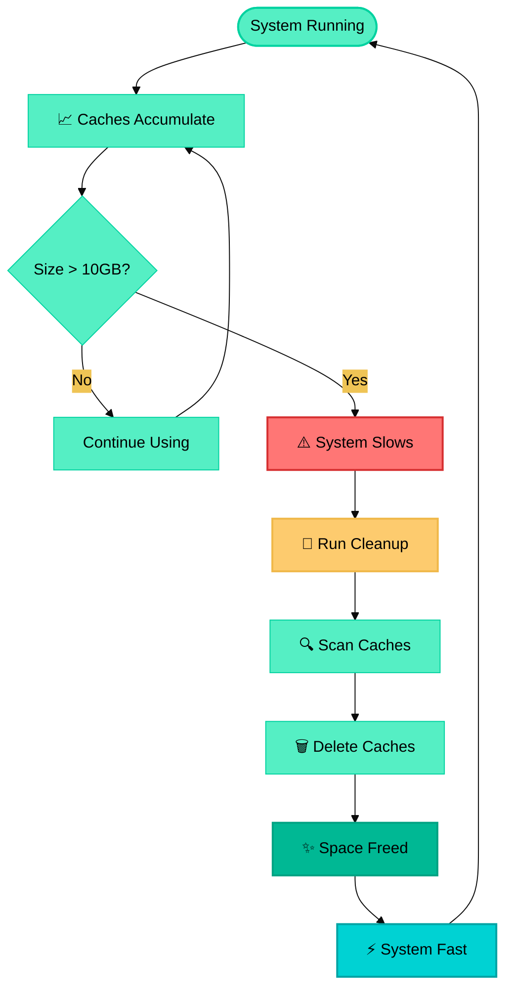

# 📊 System Cleanup Master - Visualizations

Complete visual guide to understanding the cleanup process.

## 🎯 Cleanup Decision Tree

## 🔄 File Processing Pipeline

## 📈 Performance Metrics Timeline

```mermaid
%%{init: {'theme':'base', 'themeVariables': { 'primaryColor':'#f093fb','primaryTextColor':'#fff'}}}%%
gantt
    title Cleanup Operations Timeline
    dateFormat ss
    axisFormat %S sec
    
    section Scanning
    Scan Downloads        :a1, 00, 3s
    Scan Caches          :a2, after a1, 5s
    Find Duplicates      :a3, after a2, 2s
    
    section Analysis
    Calculate Sizes      :b1, after a3, 2s
    Group Files          :b2, after b1, 1s
    Generate Report      :b3, after b2, 1s
    
    section Cleanup
    Delete Duplicates    :c1, after b3, 2s
    Clear Caches         :c2, after c1, 4s
    Organize Files       :c3, after c2, 3s
    
    section Finalize
    Update Stats         :d1, after c3, 1s
    Show Summary         :d2, after d1, 1s
```

## 🎨 Category Distribution

## 🏗️ Component Architecture

## 🔐 Safety Flow

## 📊 Before vs After Comparison

## 🎯 User Journey

## 🔄 Cache Cleanup Cycle

## 🎨 Color Legend

| Color | Meaning | Use Case |
|-------|---------|----------|
| 🔵 **Blue** | Information, Scanning | Non-destructive operations |
| 🟢 **Green** | Success, Completion | Successful operations |
| 🟡 **Yellow** | Warning, Confirmation | Requires attention |
| 🔴 **Red** | Deletion, Critical | Destructive operations |
| 🟣 **Purple** | Processing, Analysis | Background tasks |
| 🟠 **Orange** | System-level | Requires privileges |

---

**Navigation:** [← Back to README](README.md) | [View Code →](cleanup_master.py)
